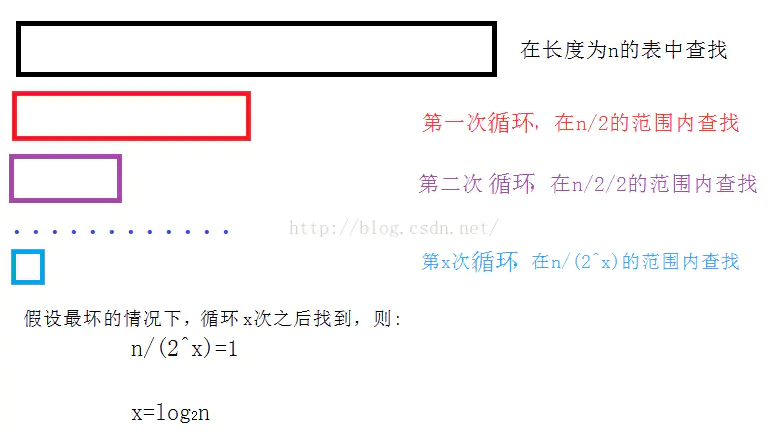
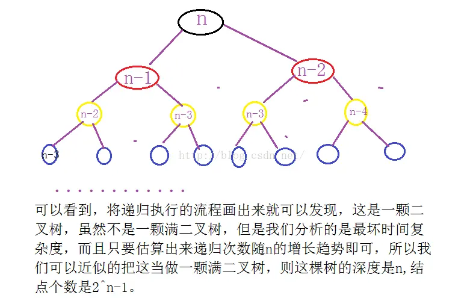

空间复杂度（Space Complexity）
 一个程序的空间复杂度是指运行完一个程序所需内存的大小，利用程序的空间复杂度，可以对程序的运行所需要的内存多少有个预先估计。一个程序执行时除了需要存储空间和存储本身所使用的指令、常数、变量和输入数据外，还需要一些对数据进行操作的工作单元和存储一些为现实计算所需信息的辅助空间。程序执行时所需存储空间包括以下两部分。 
 
 （1）固定部分：这部分空间的大小与输入/输出的数据的个数多少、数值无关，主要包括指令空间（即代码空间）、数据空间（常量、简单变量）等所占的空间，这部分属于静态空间。 
 
 （2）可变空间：这部分空间的主要包括动态分配的空间，以及递归栈所需的空间等，这部分的空间大小与算法有关。一个算法所需的存储空间用f(n)表示。S(n)=O(f(n))，其中n为问题的规模，S(n)表示空间复杂度。
 
 1、空间复杂度是对一个算法在运行过程中临时占用存储空间大小的量度。
 
 2、一个算法在计算机上占用的内存包括：程序代码所占用的空间、输入输出数据所占用的空间、辅助变量所占用的空间这三个方面。程序代码所占用的空间取决于算法本身的长短，输入输出数据所占用的空间取决于要解决的问题，是通过参数表调用函数传递而来，只有辅助变量是算法运行过程中临时占用的存储空间，与空间复杂度相关。
 
 3、通常来说，只要算法不涉及到动态分配的空间以及递归、栈所需的空间，空间复杂度通常为0(1)。
 
 4、算法的空间复杂度并不是计算实际占用的空间，而是计算整个算法的辅助空间单元的个数，与问题的规模没有关系。
 
 
 特殊空间复杂度 
 在斐波那契数求空间复杂度的过程中，我们需要考虑函数栈帧的过程，比如当我们求第五个斐波那契数的时候，这时候需要先开辟空间存放第四个数，然后再开辟空间存放第三个数；当开辟空间到第二个和第一个数的时候，第三个数得到结果并返回到第四个数中，第四个数的值已知后返回到第五个数中，在这个过程中，最大占用空间即为层数减一。如下图所示：
   
  
  开辟空间的大小最多等于层数+1，也就是说求第N个斐波那契数，空间复杂度即为O（N）。 
  
  二分查找因为整个运算过程没有空间的改变，所以空间复杂度为O（1）。
  
  
  
  时间复杂度与空间复杂度的联系
  对于一个算法，其时间复杂度和空间复杂度往往是相互影响的。当追求一个较好的时间复杂度时，可能会使空间复杂度的性能变差，即可能导致占用较多的存储空间;反之，当追求一个较好的空间复杂度时，可能会使时间复杂度的性能变差，即可能导致占用较长的运行时间。
  
  1、求二分法的时间复杂度和空间复杂度
  非递归：
  
  templateT* BinarySearch(T* array,int number,const T& data)
  
  {
  
        assert(number>=0);
  
        int left = 0;
  
        int right = number-1;
  
        while (right >= left)
  
        {
  
                int mid = (left&right) + ((left^right)>>1);
  
                if (array[mid] > data)
  
                {
  
                      right = mid - 1;
  
                }
  
                else if (array[mid] < data)
  
                {
  
                      left = mid + 1;
  
                }
  
                else
  
                {
  
                      return (array + mid);
  
                }
  
        }
  
        return NULL;
  
  }
  
  分析：
  

  循环的基本次数是log2N，所以，时间复杂度是O(log2N);
  
  由于辅助空间是常数级别的，所以，空间复杂度是O(1)。
  
  
  
  递归：
  
  templateT* BinarySearch(T* left,T* right,const T& data)
  
  {
  
        assert(left);
  
        assert(right);
  
        if (right >=left)
  
        {
  
                T* mid =left+(right-left)/2;
  
                if (*mid == data)
  
                      return mid;
  
                else
  
                      return *mid > data ? BinarySearch(left, mid - 1, data) : BinarySearch(mid + 1, right, data);
  
        }
  
        else
  
        {
  
                return NULL;
  
        }
  
  }
  
  分析：
  
   !
   
 递归的次数和深度都是log2N,每次所需要的辅助空间都是常数级别的：
 
 时间复杂度:O(log2N)
 
 空间复杂度：O(log2N )
 
 
 
 2、斐波那契数列的时间和空间复杂度
 //递归情况下的斐波那契数列
 
 long long Fib(int n)
 
 {
 
       assert(n >= 0);
 
       return n<2 ? n : Fib(n - 1) + Fib(n-2);
 
 }
 
 
 

     递归的时间复杂度是：  递归次数*每次递归中执行基本操作的次数，所以，时间复杂度是： O(2^N)。
     
     递归的空间复杂度是：  递归的深度*每次递归所需的辅助空间的个数，所以，空间复杂度是：O(N)。
     
     
     
     //求前n项中每一项的斐波那契数列的值
     
     long long *Fib(int n)
     
     {
     
           assert(n>=0);
     
           long long *array = new long long[n + 1];
     
           array[0] = 0;
     
           if (n > 0)
     
           {
     
                   array[1] = 1;
     
           }
     
           for (int i = 2; i
     
     循环的基本操作次数是n-1,辅助空间是n+1，所以：
     
     时间复杂度O(n)
     
     空间复杂度O(n)
     
     
     
     //非递归
     
     long long Fib(int n)
     
     {
     
           assert(n >= 0);
     
           long long first=0,second=1;
     
           for (int i = 2; i <= n; i++)
     
           {
     
                   first = first^second;
     
                   second = first^second;
     
                   first = first^second;
     
                   second = first + second;
     
           }
     
           return second;
     
     }
     
     循环的基本次数是n-1，所用的辅助空间是常数级别的：
     
     时间复杂度：O(n)
     
     空间复杂度：O(1)
     
     总结
     对于一个算法，算法的时间复杂度和空间复杂度往往是相互影响的，其所有性能之间都存在着或多或少的相互影响，因此，当设计一个算法(特别是大型算法)时，要综合考虑算法的各项性能、算法的使用频率、算法处理的数据量的大小、算法描述语言的特性、算法运行的机器系统环境等各方面因素，才能够设计出比较好的算法。
     